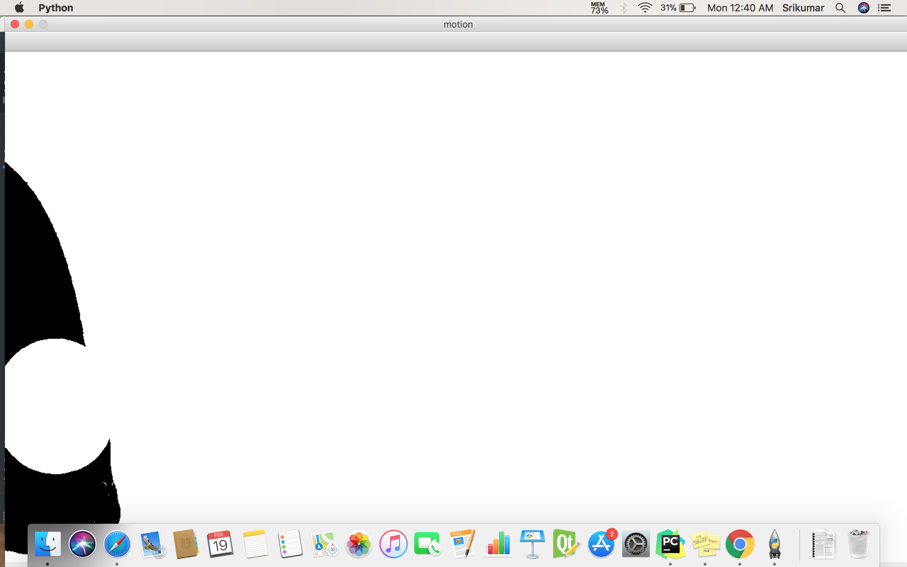

# Motion-Tracker

Motion detection algorithm based on Σ-Δ background estimation

## References
#### A new motion detection algorithm based on Sigma-Delta background estimation - [pdf](https://hal.archives-ouvertes.fr/hal-01222650/document)

#### Basic motion detection and tracking with Python and OpenCV - [website](https://www.pyimagesearch.com/2015/05/25/basic-motion-detection-and-tracking-with-python-and-opencv/)

#### MOTION DETECTION: FAST AND ROBUST ALGORITHMS FOR EMBEDDED SYSTEMS - [pdf](http://perso.ensta-paristech.fr/~manzaner/Publis/icip09.pdf)

#### Motion Detection and Tracking - [pdf](http://www.cse.iitm.ac.in/~vplab/courses/CV_DIP/PDF/Motion_Detection_and_Tracking.pdf)

